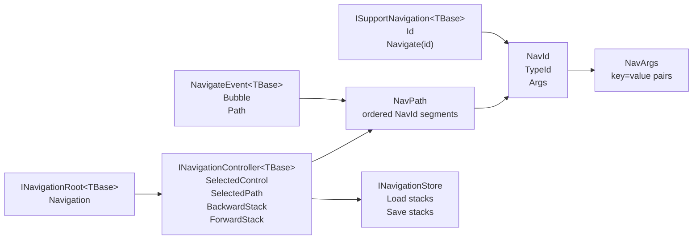
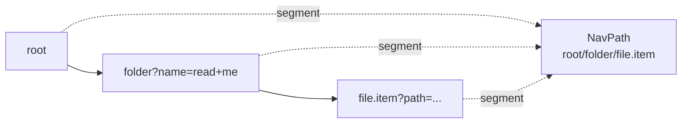
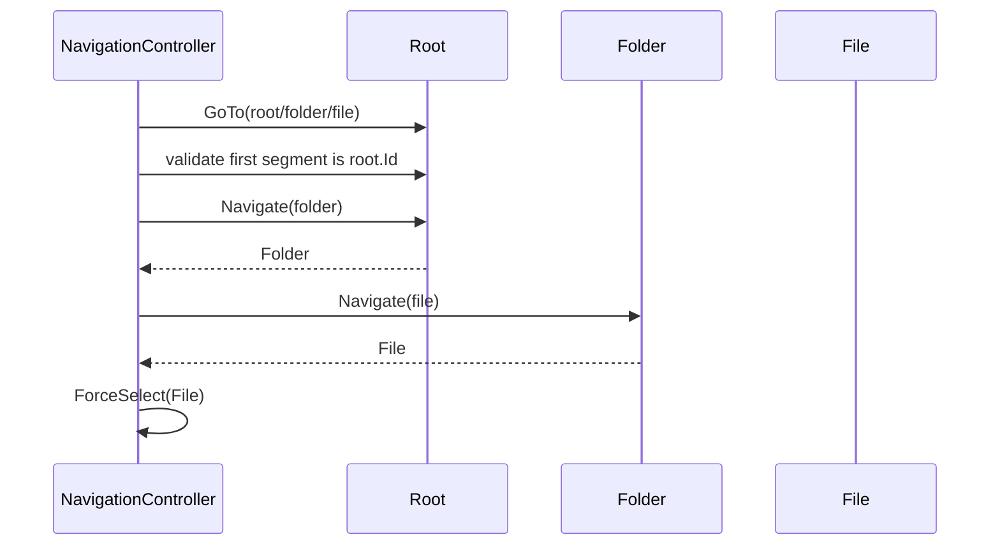
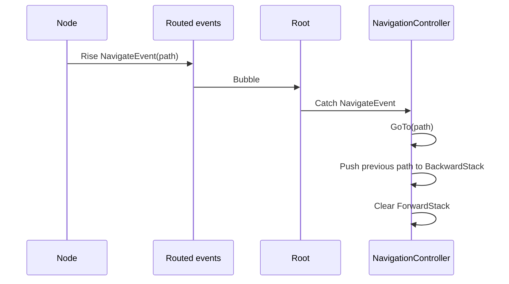
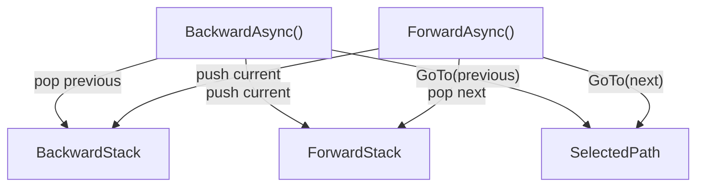
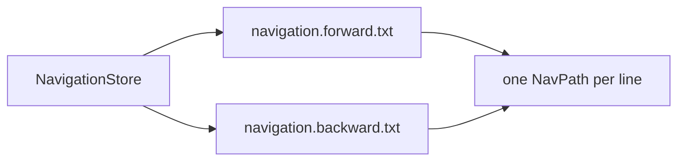

# Navigation

The navigation layer selects a node inside an `Asv.Modeling` tree by a stable path. It provides typed identifiers, path parsing/formatting, routed navigation requests, selected-state tracking, backward/forward stacks, and optional persistence for navigation history.

The main idea is that navigation is path-based rather than reference-based. A UI or controller can request a `NavPath`, and the root navigation controller resolves that path through the current tree by asking each node to navigate to the next `NavId`.

## Core Types



| Type | Responsibility |
| --- | --- |
| `NavId` | Stable segment identifier with a type id and optional URL-encoded args. |
| `NavArgs` | Ordered key/value arguments used inside a `NavId`. |
| `NavPath` | Ordered path of `NavId` segments from root to target. |
| `ISupportNavigation<TBase>` | Exposes `Id` and resolves a direct child by `NavId`. |
| `NavigateEvent<TBase>` | Bubbles a navigation request to the root controller. |
| `INavigationController<TBase>` | Maintains selected node, selected path, and backward/forward history. |
| `INavigationStore` | Persists backward and forward stacks. |

## Identifiers And Paths

`NavId` is the stable address of one node level. The `TypeId` allows letters, digits, `.`, `_`, and `-`. Optional args are encoded after `?`.

```text
file.item?path=C%3A%5CTemp%5CMy+File.txt
```

`NavPath` joins `NavId` segments with `/`:

```text
root/folder?name=read+me/file.item?path=C%3A%5CTemp%5CFile.txt
```



Use `NavId.GenerateByHash(...)` when a stable identifier must be derived from domain data. Use `NavId.GenerateRandomAsString(...)` only when persistence and restore do not require deterministic ids.

## Resolving A Path

Navigation resolution is incremental. The controller starts from its owner root and calls `Navigate(nextId)` on the current node for every next segment.



`NavigationMixin.NavigateByPath(...)` provides the same step-by-step path resolution for any `ISupportNavigation<TBase>` node.

`NavigationController.GoTo(...)` also calls `Focus()` when the selected node implements `ISupportFocus`.

## Routed Navigation Request

Most feature code should publish a navigation request instead of directly owning the controller. `NavigateEvent<TBase>` uses `RoutingStrategy.Bubble`, so any node can raise the event and the root controller can handle it.



If the requested path is already selected, the controller ignores the event and does not modify history.

## Backward And Forward

The controller keeps browser-like navigation stacks:



When direct navigation succeeds, the previous selected path is pushed to `BackwardStack` and `ForwardStack` is cleared. When `BackwardAsync()` or `ForwardAsync()` fails, the popped path is pushed back to avoid losing history state.

`Backward` and `Forward` are `ReactiveCommand` instances. Their `CanExecute` state follows the matching stack count.

## Persistence

`NavigationStore` persists stacks as text files in a storage directory:



On load, invalid or empty lines are skipped. On dispose, `NavigationController` saves both stacks and clears them.

## Design Rules

- Keep `NavId` stable for nodes that need navigation history, layout, or undo restore.
- Make `Navigate(id)` resolve direct children only; path traversal is handled by the controller/mixin.
- Ensure controller paths start with the controller root id.
- Raise `NavigateEvent<TBase>` for decoupled navigation requests.
- Use `ForceSelect(...)` only when selection changed outside normal navigation flow.
- Persist navigation stacks only when restoring back/forward state is useful for the user.
- If a selected node can receive focus, implement `ISupportFocus`.
