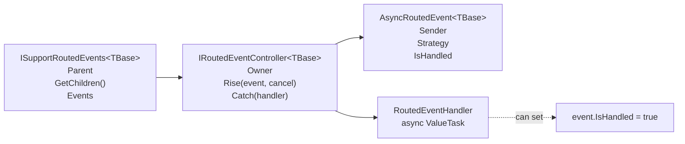
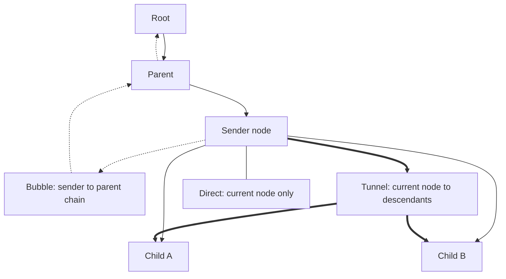
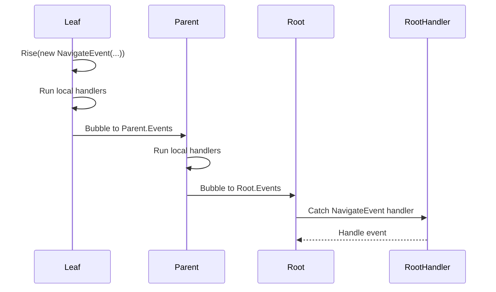
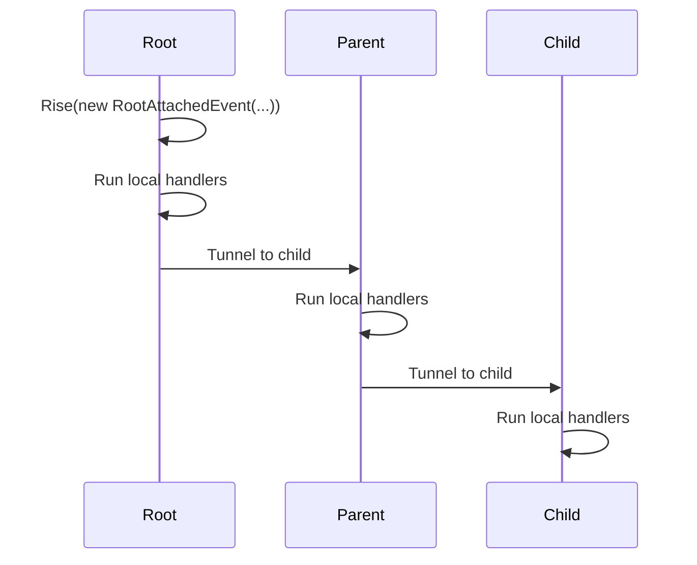

# Routed Events

Routed events are the shared asynchronous messaging mechanism for model trees. A node raises a typed event, local handlers can process it, and the event controller routes the same event object through the tree according to its `RoutingStrategy`.

The main idea is to keep feature controllers loosely coupled. A leaf can publish an intent such as navigation, layout load/save, undo change, or root attachment, while the component that owns the behavior can handle it elsewhere in the tree.

## Core Types



`ISupportRoutedEvents<TBase>` requires parent and child access because routing is tree-based. `RoutedEventController<T>` owns the handler list for one node and decides where the event goes after local handlers run.

## Routing Strategies



| Strategy | Direction | Typical use |
| --- | --- | --- |
| `Bubble` | Current node, then parent chain until the root. | A leaf asks an ancestor-level controller to handle a request. |
| `Tunnel` | Current node, then descendants depth-first. | A root or subtree owner notifies the whole subtree. |
| `Direct` | Current node only. | Local async notification without propagation. |

Handlers run before propagation from the current node. If a handler sets `IsHandled = true`, routing stops and no next node receives the event.

## Bubble Flow

Bubble events are used when a lower-level node publishes something that an owner higher in the tree should process. Navigation, layout, and undo use this pattern.



Example event types:

- `NavigateEvent<TBase>` bubbles a navigation request to the navigation controller.
- `LoadLayoutEvent<TBase, TData>` bubbles until a layout store handler loads data.
- `SaveLayoutEvent<TBase, TData>` bubbles saved layout data toward the store owner.
- `UndoEvent<TBase>` bubbles a published undo change into undo history.

## Tunnel Flow

Tunnel events move from the current node down through descendants. Root tracking uses this to update every node in an attached or detached subtree.



`RiseBroadcast()` is a convenience method for tunnel events. It validates that the event uses `RoutingStrategy.Tunnel`, finds the root with `GetRoot()`, and starts routing from there.

## Handling Events

Register handlers through `Events.Catch(...)`. The returned `IDisposable` unregisters the handler.

```csharp
var subscription = owner.Events.Catch<NavigateEvent<IViewModel>>(
    async (node, e, cancel) =>
    {
        await GoTo(e.Path);
        e.IsHandled = true;
    }
);
```

Use the typed overload when the handler only cares about one event type. Use the base `RoutedEventHandler<TBase>` overload for infrastructure that needs to observe several event types.

## Design Rules

- Keep event payloads small and immutable except for explicit result fields such as `IsLoaded`.
- Set `IsHandled` only when the handler fully owns the event and propagation must stop.
- Prefer `Bubble` for requests that need an ancestor service.
- Prefer `Tunnel` for subtree state notifications.
- Pass `CancellationToken` through handlers and `Rise(...)` calls.
- Dispose handler subscriptions with the owning controller or view model.
