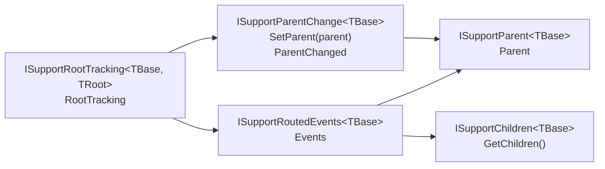
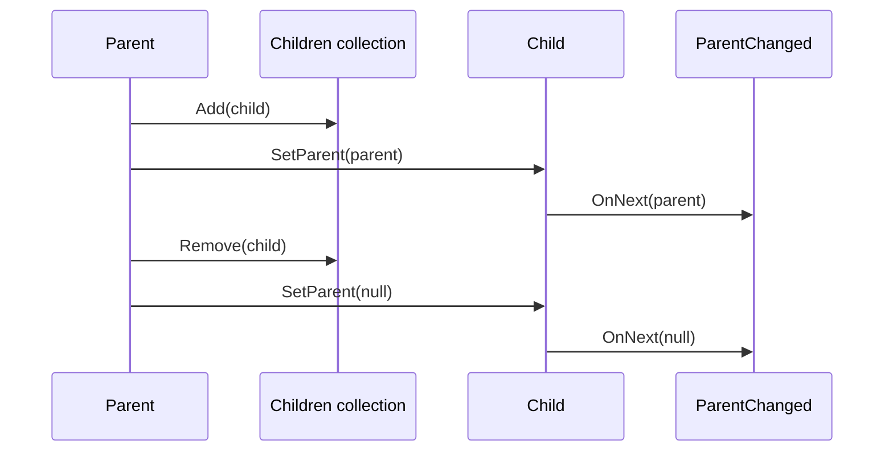
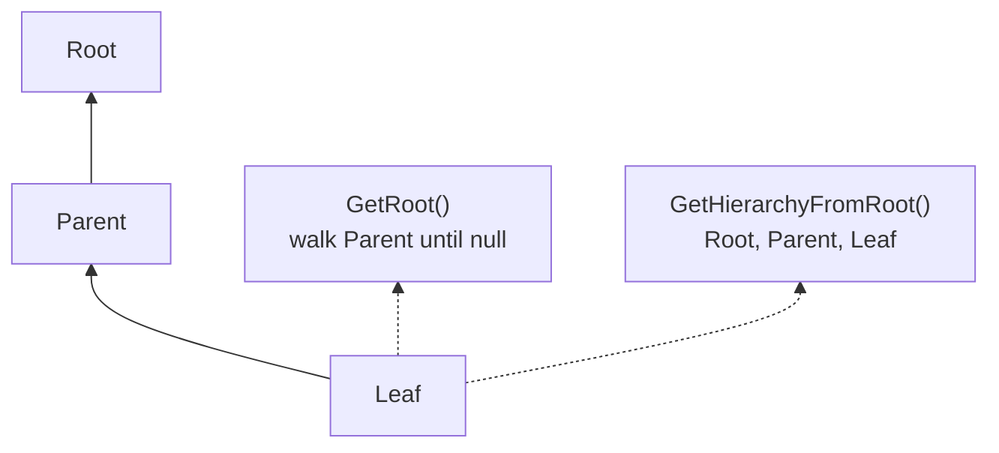
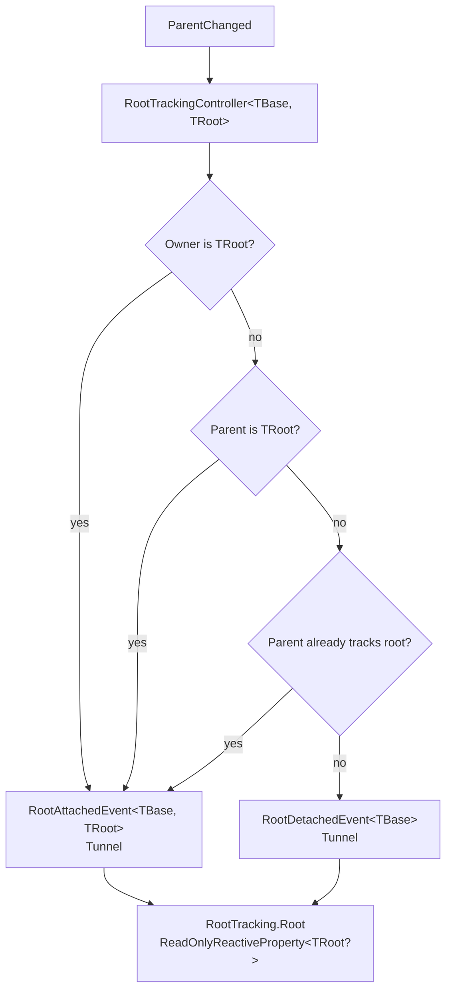
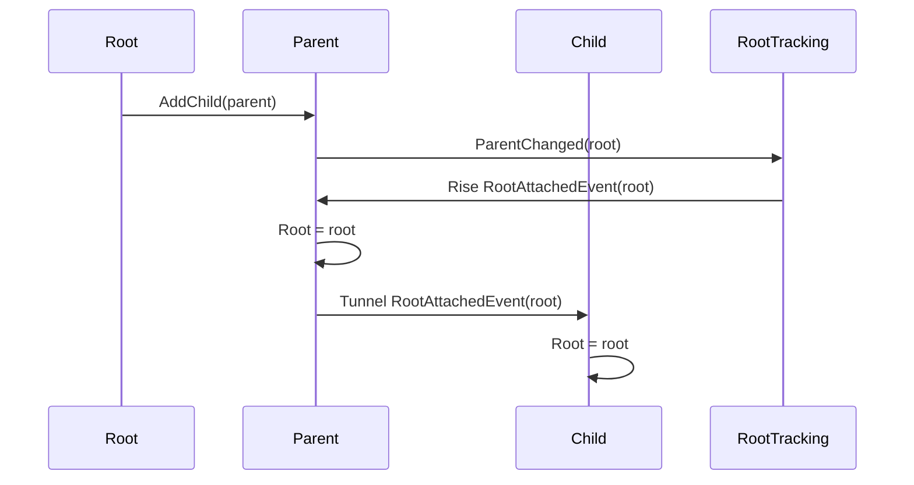

# Tree

The tree layer is the structural foundation of `Asv.Modeling`. It gives model objects a parent-child relationship, helper methods for walking the hierarchy, and optional root tracking for features that should start only after a node is attached to an application root.

The main idea is deliberately small: a node does not need a heavy base class to participate in the model tree. It only needs to expose its parent, expose its children, and notify when its parent changes. Higher-level features such as routed events, navigation, layout, and undo build on top of that structure.

## Core Contracts



| Contract | Responsibility |
| --- | --- |
| `ISupportParent<TBase>` | Exposes the current parent or `null` for a root/detached node. |
| `ISupportChildren<TBase>` | Enumerates direct children. |
| `ISupportParentChange<TBase>` | Allows parent changes and publishes `ParentChanged`. |
| `ISupportRoutedEvents<TBase>` | Combines tree access with routed event dispatch. |
| `ISupportRootTracking<TBase, TRoot>` | Exposes a controller that tracks the current root. |

The contracts stay separate so a type can opt into only the tree behaviors it needs.

## Parent And Children

Tree ownership is usually maintained by the parent collection. When a child is added, the owner calls `SetParent(this)`. When it is removed, the owner calls `SetParent(null)`.



This keeps the relationship explicit and avoids hidden global state. A node can always answer two local questions:

- Who is my parent?
- Which direct children do I own?

Everything else is derived from those two relationships.

## Traversal Helpers

`SupportParentMixin` provides small helpers over the parent chain.



`GetRoot()` walks `Parent` until it finds the topmost node. `GetHierarchyFromRoot()` returns the path from the root to the current node.

There are also `SetParent(...)` helpers for `IObservableCollection<TModel>` and `ISynchronizedView<TModel, TView>`. They assign the parent to existing items and keep parent references synchronized when items are added or removed.

## Root Tracking

Root tracking is the bridge between a plain parent-child tree and lifecycle-aware controllers. A node can observe when it becomes attached to a root, detached from a root, or moved under another root.



The controller listens to `ParentChanged` and raises tunnel routed events:

- `RootAttachedEvent<TBase, TRoot>` when the owner is the root, the parent is the root, or the parent already knows a root.
- `RootDetachedEvent<TBase>` when no root can be resolved.

Because these events tunnel through descendants, an existing subtree can be attached later and every node in that subtree receives the same root update.

## Attach Subtree Flow



This is the behavior covered by root tracking tests:

- A root node tracks itself.
- A child tracks the root when attached directly to the root.
- An existing subtree tracks the root when the subtree is attached later.
- Detaching a subtree clears root tracking for every node in that subtree.

## Executing After Root Attachment

`IRootTrackingController<TRoot>` exposes a reactive `Root` property and convenience streams:

- `Attached` emits non-null root values.
- `Detached` emits when the root becomes `null`.
- `ExecuteWhenRootAttached(...)` runs immediately if a root already exists and again on future attachments.

```csharp
using var subscription = node.RootTracking.ExecuteWhenRootAttached(
    async (root, cancel) =>
    {
        await node.Layout.LoadAllAsync(cancel);
    }
);
```

This pattern is useful for controllers that cannot fully initialize until their node is part of a rooted tree. Layout loading uses this approach so layout data is requested only after a node has an attached root.

## Design Rules

- Treat `SetParent(...)` as the single place where parent changes are published.
- Keep `GetChildren()` limited to direct children; traversal helpers derive hierarchy behavior.
- When maintaining observable child collections, use the `SetParent(...)` collection helpers to keep parent references synchronized.
- Use root tracking for behavior that depends on a complete rooted tree.
- Dispose root tracking and routed event subscriptions with the owning node or controller.
- Avoid cycles. The tree helpers assume that following `Parent` eventually reaches `null`.
