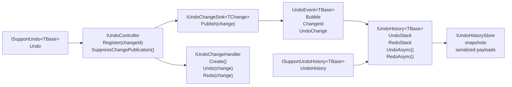
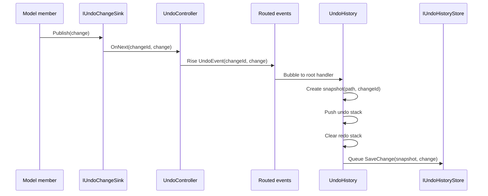
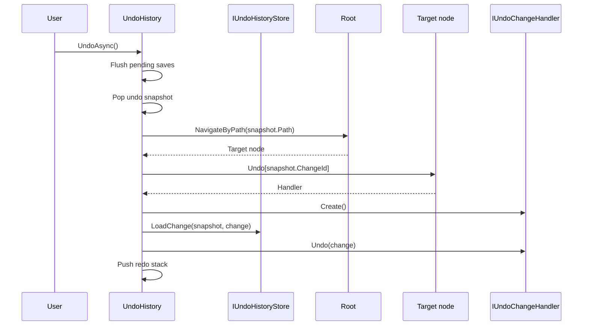
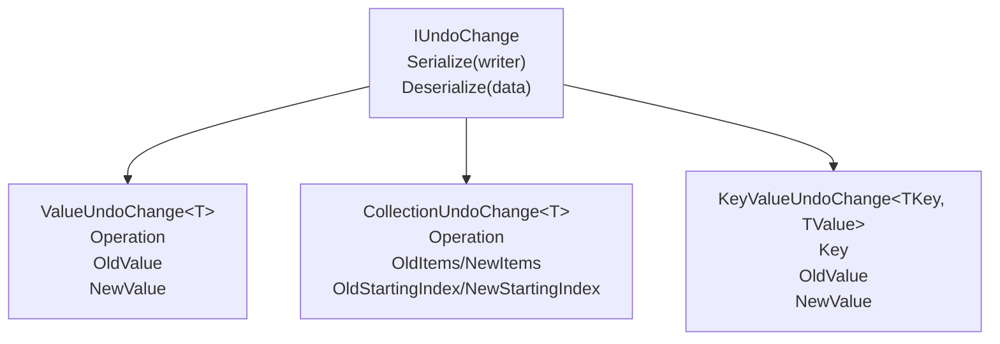
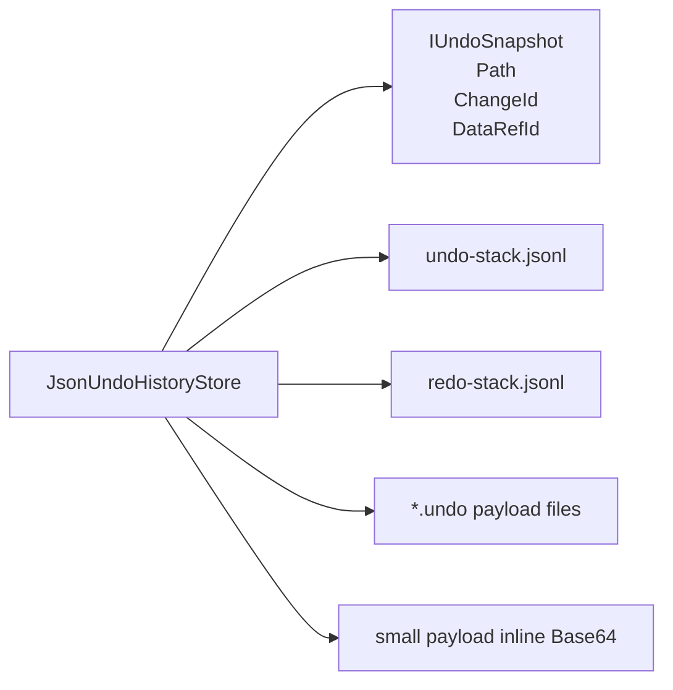

# Undo

The undo layer records user-visible model changes and replays them later as undo or redo operations. It is built on top of three lower-level ideas from `Asv.Modeling`: routed events, navigation paths, and serializable change payloads.

The main idea is to separate change publication from history ownership. A node owns the local logic needed to undo and redo its own changes, but a root-level history owns the stacks, persistence, and commands.

## Core Types



| Type | Responsibility |
| --- | --- |
| `IUndoController` | Registers local undo handlers and publishes local changes. |
| `IUndoChangeSink<TChange>` | Publishes a typed change into the owning controller. |
| `IUndoChangeHandler` | Creates, undoes, and redoes a registered change type. |
| `UndoEvent<TBase>` | Bubbles a published change to the history owner. |
| `IUndoHistory<TBase>` | Maintains undo/redo stacks and executes history operations. |
| `IUndoHistoryStore` | Persists stack snapshots and serialized change payloads. |

## Publishing Flow

When a model member changes, its sink publishes a serializable `IUndoChange`. The controller wraps it in `UndoEvent<TBase>` and raises that event with `RoutingStrategy.Bubble`.



The history computes the path from the history root to the event sender and stores that path in the snapshot. That path is later used to find the same node when undo or redo is executed.

## Undo Flow



Redo is symmetric: the history pops from `RedoStack`, loads the same change payload, calls `handler.Redo(change)`, and pushes the snapshot back to `UndoStack`.

If execution fails, the snapshot is pushed back to the stack it came from so history state is not lost.

## Change Payloads

Undo changes are serializable objects. Every change implements `IUndoChange`:



| Change type | Use case |
| --- | --- |
| `ValueUndoChange<T>` | A single value changed from old value to new value. |
| `CollectionUndoChange<T>` | An observable list item or range was added, removed, or replaced. |
| `KeyValueUndoChange<TKey, TValue>` | A keyed value changed. |

`ChangeOperation` describes the logical operation: `Create`, `Update`, `Delete`, or `Read`.

## Registration Patterns

Register a member with `IUndoController.Register(...)` when custom undo/redo behavior is needed.

```csharp
var sink = Undo.Register<ValueUndoChange<string>>(
    "Title",
    change => Title.Value = change.OldValue,
    change => Title.Value = change.NewValue
);
```

For common value and collection cases, use the mixins:

```csharp
Undo.Create(nameof(Title), Title);
Undo.Create(nameof(Items), Items);
```

The value helper subscribes to a `ReactiveProperty<T>` and publishes pairwise old/new values. The collection helper subscribes to an `ObservableList<T>` and publishes add, remove, and replace operations.

## Suppression

Undo and redo operations must not create new history entries while they are applying old data. `UndoChangeHandlerRegistration<TChange>` suppresses its own publication while `Undo(...)` or `Redo(...)` runs.

Use `IUndoController.SuppressChangePublication()` for broader scopes where multiple changes should not be recorded:

```csharp
using (Undo.SuppressChangePublication())
{
    Title.Value = restoredTitle;
    Items.Clear();
}
```

Nested suppression scopes are supported.

## Persistence

`UndoHistory<TBase>` delegates persistence to `IUndoHistoryStore`.



`JsonUndoHistoryStore` stores undo and redo stacks as JSON lines. Small serialized payloads are stored inline as Base64; larger payloads are stored in separate `.undo` files referenced by `DataRefId`.

`NullUndoHistoryStore` keeps the same runtime behavior without persistent storage.

## Design Rules

- Use stable `changeId` values. History restore depends on finding the same registration later.
- Keep `IUndoChange` payloads version-aware when stored data can outlive the running process.
- Register undo handlers on the node that owns the state being changed.
- Keep the history owner high enough in the tree to receive bubbled `UndoEvent<TBase>` events.
- Make undo callbacks apply old values and redo callbacks apply new values.
- Use suppression when restoring state, loading data, or applying a command that should not create history records.
- Dispose controller registrations and history with the owning model object.
